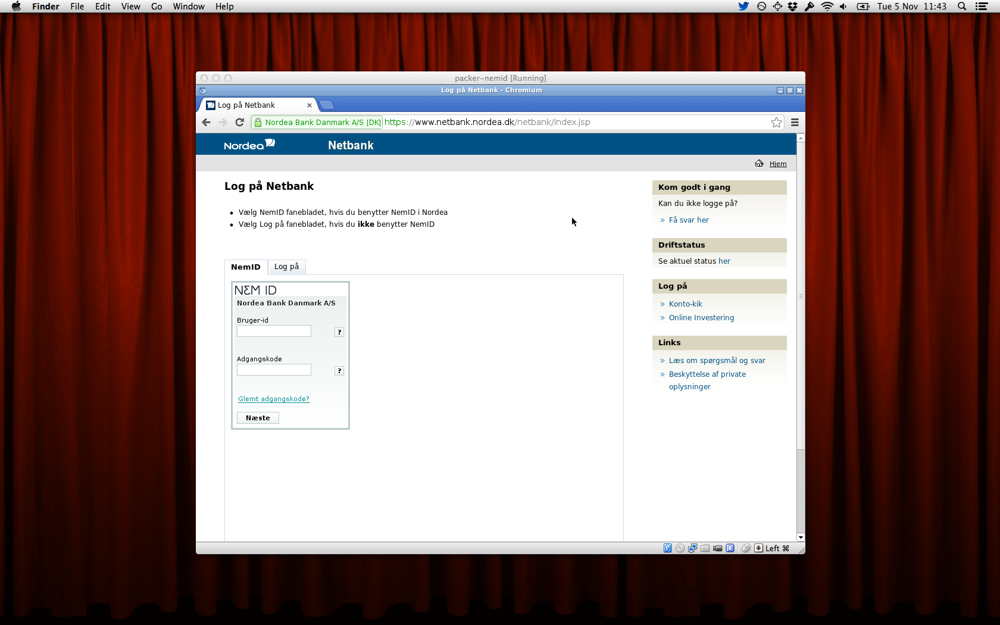

NemID Appliance
===============

Getting started
---------------

1. Download and install [VirtualBox](https://www.virtualbox.org).
2. Download the [NemID Appliance](https://dl.dropboxusercontent.com/u/2736733/NemID/packer-nemid.ova).
3. Open VirtualBox and use *File → Import Appliance* to import the appliance.
4. Start the virtual machine and log on to your online bank, nemlog-in.dk, etc.

When you're done, you can simply close the browser and right-click on the desktop to return to the console where you can type `sudo shutdown -h now` to perform a clean shutdown (this has been added to the right-click menu in the latest version of the configuration).

Requirements
------------

To run the appliance, you will need the latest stable version of [VirtualBox](https://www.virtualbox.org).

If you want to build your own appliance from scratch, you will need the latest stable versions of [Packer](http://www.packer.io) and [VirtualBox](https://www.virtualbox.org).

Acknowledgements
----------------

Uses scripts from the [VeeWee](https://github.com/jedi4ever/veewee/) project.
